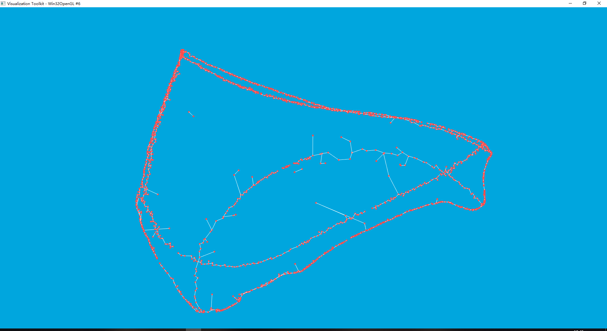

### 对比试验思路整理

#### 特征曲线提取

* 计算模型上点的[均值曲率]()，根据曲率阈值筛选点，连接这些点构造最小生成树**【我感觉这里应该是把所有的点两两相连，然后利用最小生成树算法生成一个MST】**
  * sort all leaves of the tree based on their depth**【这里不太理解深度是什么，是最小生成树每个节点的深度？但是根节点是哪一个？根节点应该在构造最小生成树的时候就定义了，但是不知道如何定义这个根节点】**
  * determine the longest path by traversing this tree
  * remove short branches from the tree
* 特征曲线的匹配**【这里用到了Largest Common Point-set（LCP）最大公共点集，具体我也没看懂】**，不过他用到了一些算法：
  * 4 points congruent set (4PCS) algorithm**【应该使用这个算法找到两个特征曲线的公共部分】**
  * Approximate Nearest Neighbor (ANN)**【他应该利用这个方法最变换的矩阵进行排序，目的是什么我这边看的不是很清楚】**

#### 多块匹配

* Reassembly Graph Representation

  * $G=(V,E)$：把碎片和碎片之间的匹配关系抽象成图
  * $n_i$：表示碎片$F_i$，并且每个碎片都伴随一个变换矩阵$X_i$（表示该碎片经过$X_i$的变换的得到的正确的位置，即$X_i(F_i)$）
  * $X_i=\left[R|t\right]=
    \left[
     \begin{matrix}
       □ & □ & □ & △ \\
       □ & □ & □ & △ \\
       □ & □ & □ & △
      \end{matrix} 
    \right]$，初始的碎片表示为$M$，$X_0=\left[R|t\right]=
    \left[
     \begin{matrix}
       1 & 0 & 0 & 0 \\
       0 & 1 & 0 & 0 \\
       0 & 0 & 1 & 0
      \end{matrix} 
    \right]$
  * $e_{i,j}^k$：表示将碎片$F_i$和碎片$F_j$对齐的操作，相关的变换矩阵为$T_{i,j}^k$

* Matching Objective Function and Constraints

  * 他定义了一些描述断面或者碎片之前的匹配程度：
    * [Hausdorff Distance](https://www.cnblogs.com/yhlx125/p/5478147.html)
    * 断面匹配score：$S_f(X_i, X_j)$
    * 碎片匹配score：$S_i(X_i,X_j)$
    * 整体区域的匹配score：$S_r(X_i,X_j)=S_f(X_i, X_j)+\alpha S_i(X_i,X_j)$
  * 接下来就抽象成了优化问题：

  $$
  \Phi(G^\prime)=\sum_{n_i,n_j\in V^\prime}{S_r(X_i,X_j)} \tag{1}
  $$

  求解$\Phi(G^\prime)$的最大值**【这个地方就复杂了，我暂时还没搞清楚该怎么弄】**

* Multipiece Reassembly Refinement

  对重组结果优化要在上一步的基础上进行**【暂时也没啥思路】**

#### 任务

- [ ] 你那边可不可以先找找，上面提到的一些算法的代码，如果能直接用在碎片模型上是最好了。
- [ ] 我这边再看看论文，我感觉这种对比实验只是重复之前的实验，如果一开始就知道有这个论文，在这篇论文基础上进行优化的方法来做这种对比实验比较好，这篇片论文的方法加到现在这篇论文，该好弄一点。

### 部分实验结果展示

* 提取点集的最小生成树

  * 计算边缘点集（论文中是根据均值曲率过滤边缘点集，我们之前是利用学习的方法过滤边缘三角面片的中心点构成的点集）
  * 连接最近邻的$k$个点，构成一个图（我们之前用的方法是连接近邻三角面片）
  * 利用最小生成树算法，生成特征曲线

  

* 能否在此基础上改进我们之前的方法，也算是对论文的改进了